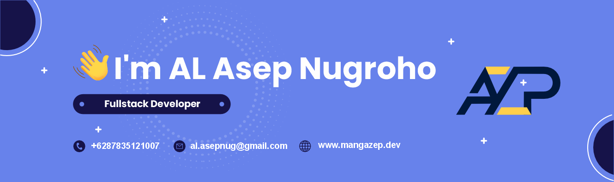

  

## 💡 About Me

Meet Asep Nugroho a.k.a mangazep, a Full-Stack dev with 6+ years of experience building scalable mobile and web applications.
Coding native Android, cross-platform (Flutter) and Web development, familiar with multiple mobile and web frameworks such as flutter, laravel, flask and vue.
Now a freelance dev, Ex [Solusi247](https://solusi247.com/) & [Muxe BV](https://www.muxebv.com/). For me, programming is the art of abstracting the world around us into elegant and efficient solutions.

Check out [mangazep .dev](https://mangazep.dev/) for personal work and a deeper dive into my professional journey.

## 🛠️ Skills

### Languages

    

### Mobile Development

    

### Frontend Development

    

### Backend Development

    

### Database

    

### Tools & Others

    

## 🚀 Featured Projects

- [Safeswap Apps](https://play.google.com/store/apps/details?id=com.muxe.safeswap) - Application to support decentralized trading protocol platform that allows various types of cryptocurrencies to be exchanged using the [safeswap.online](https://safeswap.online/) platform built with Kotlin.
- [AIS Nesantara Apps](https://solusi247.com/nesantara/) - A fisherman's position tracking application connected to an AIS transmitter. Developed to improve safety and prevent fatal accidents and deaths due to missing fishermen on the high seas built with java.
- [SAKTI Apps](https://play.google.com/store/apps/details?id=com.bkpsdmsragen.sakti) - Location based attendance application for Civil Servants employees (PNS & PPPK) within the Sragen Regency Government built with kotlin.
- [POWERPALS Game Backend](https://powerpals.xyz) - Epic Mini Game with its foundations in blockchain technology built with laravel.

## 📊 My Stats

 
Full Stats (click me to toggle 👀)

<!-- 

  

 -->

## 🔗 Connect With Me

 

---

  

